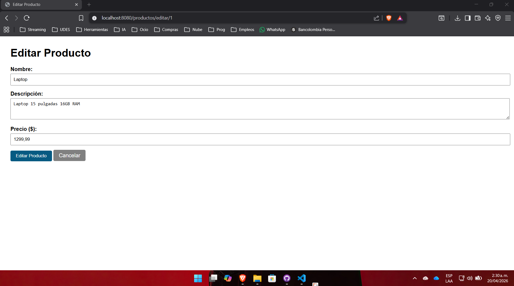
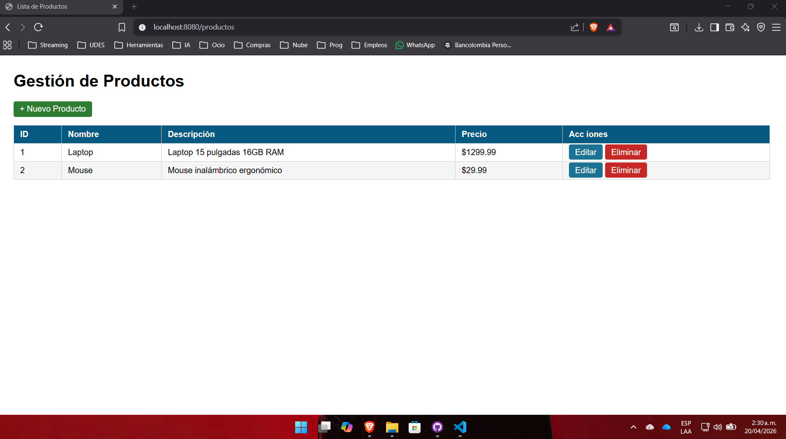
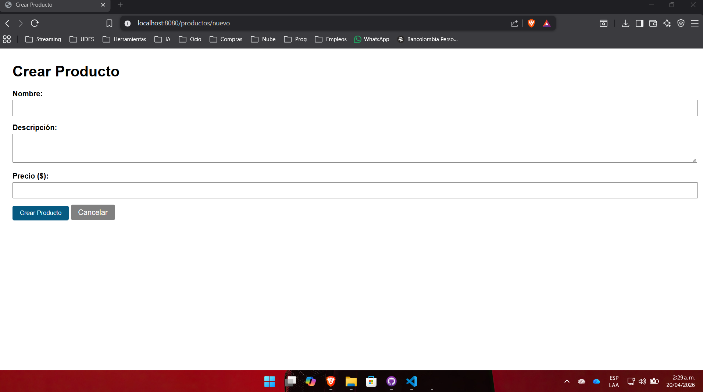
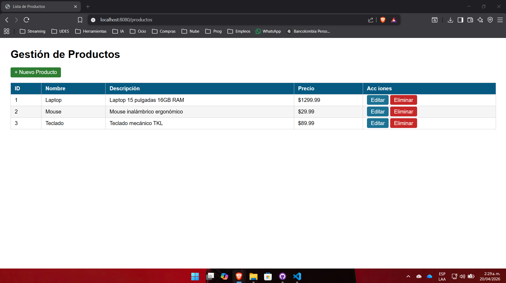

# Gestión de Productos - Spring Boot CRUD

Proyecto de laboratorio para la Unidad 7 del curso **Programación Web**.  
Aplicación web completa que implementa operaciones CRUD (Crear, Leer, Actualizar, Eliminar) sobre una entidad `Producto`, utilizando **Spring Boot**, **Thymeleaf** como motor de plantillas y un repositorio en memoria (HashMap). Se aplica el patrón **Post/Redirect/Get (PRG)** para evitar el reenvío de formularios.

## Funcionalidades

- Listar todos los productos.
- Crear un nuevo producto.
- Editar un producto existente.
- Eliminar un producto (con confirmación JavaScript).

## Tecnologías utilizadas

- Java 17
- Spring Boot 3.2.x
- Thymeleaf
- Maven
- Embedded Tomcat (Spring Boot)

## Estructura del proyecto
src/
├── main/
│ ├── java/com/universidad/productosweb/
│ │ ├── ProductosWebApplication.java
│ │ ├── controller/ProductoController.java
│ │ ├── model/Producto.java
│ │ └── service/ProductoService.java
│ └── resources/
│ ├── application.properties
│ └── templates/productos/
│ ├── lista.html
│ └── formulario.html
└── pom.xml

## Requisitos previos

- JDK 17 o superior
- Maven 3.8+ (o usar el wrapper `mvnw` incluido)

## Ejecución

1. Clona el repositorio:
   ```bash
   git clone https://github.com/tuusuario/apellido-post1-u7.git
   cd apellido-post1-u7

2. Compila y ejecuta la aplicación:

bash
mvn spring-boot:run
Si no tienes Maven instalado, usa ./mvnw spring-boot:run (Linux/Mac) o .\mvnw spring-boot:run (Windows).

3. Abre el navegador en: http://localhost:8080/productos

Capturas de pantalla





Lista de productos
https://screenshots/lista.png

Formulario de creación
https://screenshots/nuevo.png

Formulario de edición
https://screenshots/editar.png


De esta forma, si el usuario recarga la página después de guardar, no se reenvía el formulario ni se duplican los registros.

Mejoras posibles (opcionales)
Validaciones con Bean Validation (@NotNull, @Min, etc.)

Persistencia real con JPA/Hibernate y base de datos H2/MySQL

Mensajes flash de éxito/error usando RedirectAttributes

Paginación y búsqueda

Autor
Jair Sanjuan – Ingeniería de Sistemas – 2026